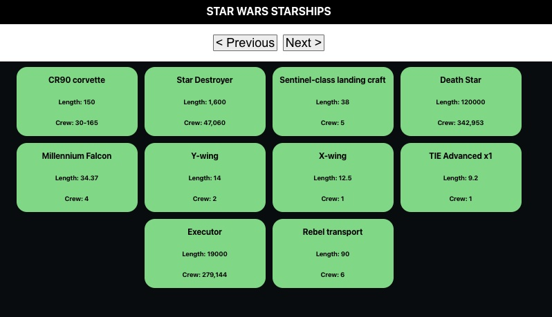

# React Star Wars API

In this project I used the Star WArs API ([SWAPI](https://swapi.dev)).
The data fetched from the API is then processed using useState and useEffect to render the ships data into their own card on the webpage. 

Screenshot of the webpage: 

